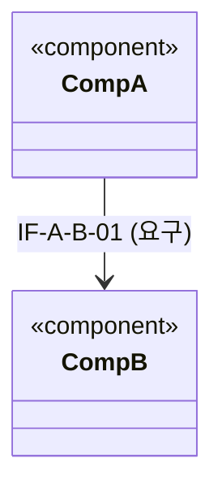
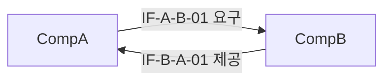
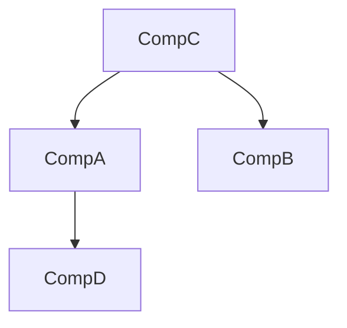
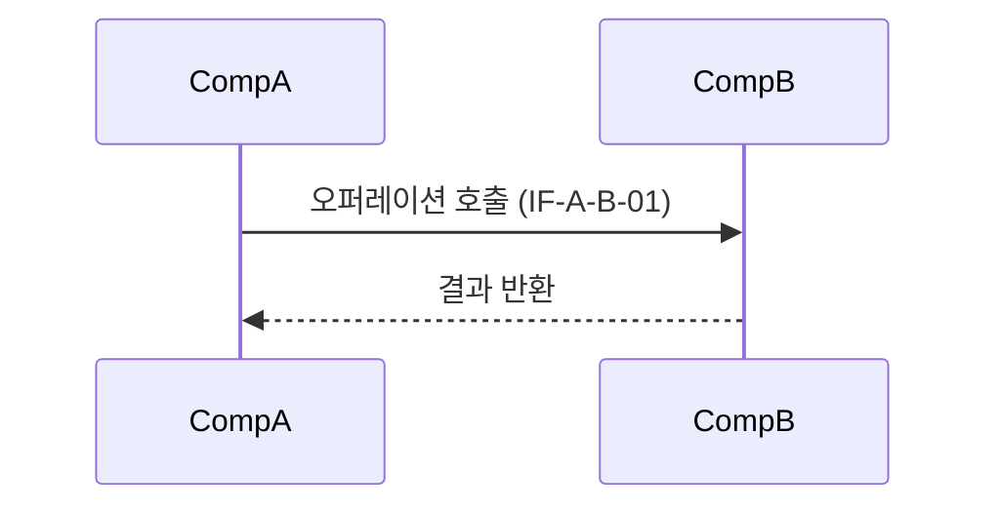
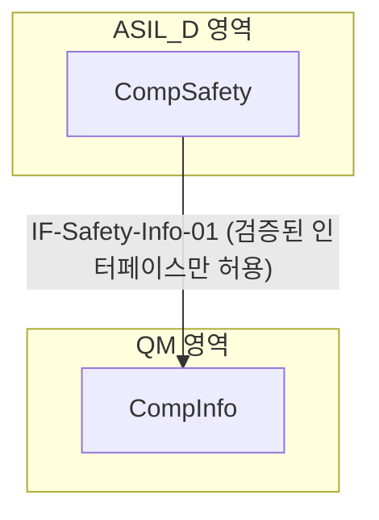

# 아키텍처 다이어그램 표현

Mermaid 문법 기본기(사용법, 한계)는 `requirements-analysis` 스킬의 `uml-sysml-diagrams.md`를 따릅니다. 이 문서는 아키텍처 산출물에 특화된 다이어그램 유형만 다룹니다.

**최종 산출물은 Mermaid가 아니라 `TPL-SWE2-002_SW 아키텍처 UML 템플릿.drawio`입니다.** 아래 Mermaid 예시는 구조를 빠르게 초안하고 검토받기 위한 중간 산출물로 사용하고, 확정되면 `template-policy.md`의 절차에 따라 drawio 파일(`ENG-SWE2-002`)로 옮겨 최종본으로 삼으세요.

## 컴포넌트 구조 및 인터페이스

Mermaid에는 UML 컴포넌트 다이어그램(롤리팝/소켓 표기)이 없으므로, `classDiagram`으로 근사하거나 인터페이스를 라벨이 있는 화살표로 표현합니다.

또는 흐름도로 제공/요구 관계를 명시:

## 컴포넌트 의존성 그래프 (통합 순서 산정용)

- 화살표 방향은 "의존한다(depends on)"를 의미합니다. `interface-and-integration.md`의 통합 순서는 이 그래프에서 의존 대상(화살표가 가리키는 쪽)이 먼저 통합되는 것을 기본으로 합니다.
- 그래프에 순환이 보이면(A→B→A) 반드시 `interface-and-integration.md`의 순환 의존성 처리 절차를 따르세요.

## 동적 상호작용 (A-SPICE가 요구하는 "동적 동작 기술")

컴포넌트 간 상호작용 순서는 `sequenceDiagram`으로 표현합니다.

## 안전 분할(간섭으로부터의 자유) 표현

ASIL이 다른 요소들의 분리를 다이어그램에 드러낼 때는 서브그래프로 경계를 명시합니다.

## 작성 규칙

- 모든 다이어그램의 컴포넌트/인터페이스 이름은 설계서 본문의 ID와 정확히 일치해야 합니다.
- 다이어그램은 텍스트 명세(인터페이스 표, 통합 순서 표)를 보완하는 것이지 대체하는 것이 아닙니다 — 다이어그램에만 있고 표에는 없는 인터페이스가 있으면 안 됩니다.
