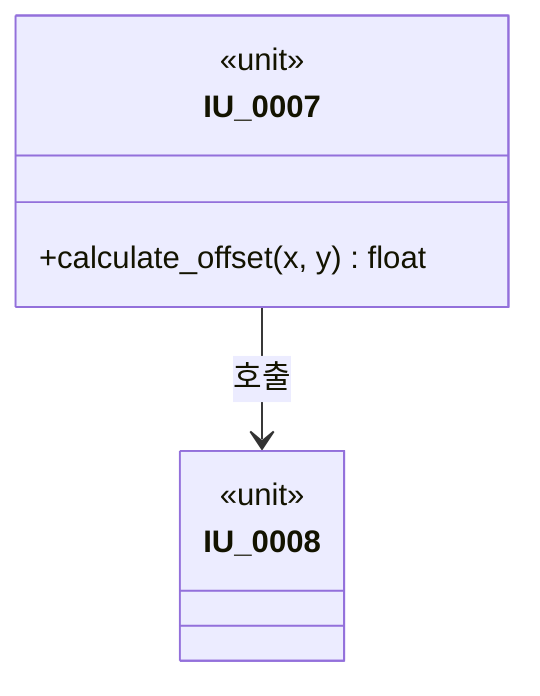
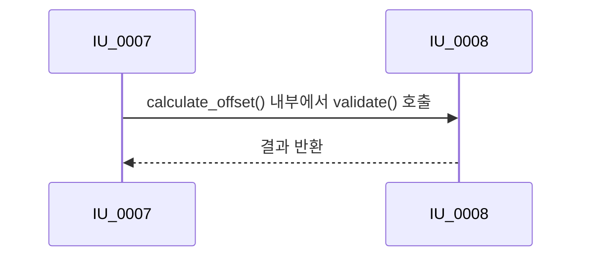
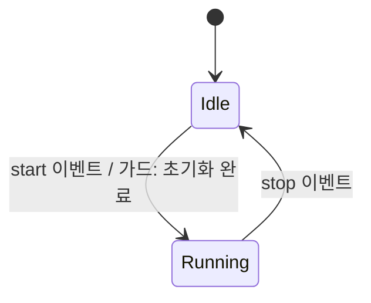
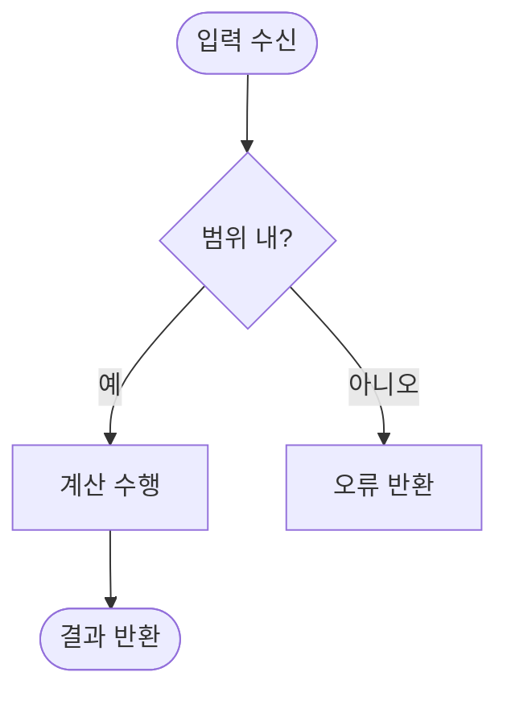

# 상세설계 다이어그램 표현 (TPL-SWE3-002 대응)

Mermaid 문법 기본기(사용법, 한계)는 `requirements-analysis` 스킬의 `uml-sysml-diagrams.md`를 따릅니다. 이 문서는 상세설계에 특화된 다이어그램만 다룹니다.

**최종 산출물은 Mermaid가 아니라 `TPL-SWE3-002_상세설계 UML 및 호출관계 템플릿.drawio`입니다.** 아래 Mermaid는 초안/검토용으로 사용하고, 확정되면 `template-policy.md`의 절차에 따라 drawio 파일(`ENG-SWE3-002`)로 옮겨 최종본으로 삼으세요. drawio 노란 안내 박스가 요구하는 4가지(①구현 단위와 책임 ②함수 또는 클래스 호출 ③입력 출력 자료형 ④설계 및 시험 추적 ID)가 모두 반영되었는지 확인한 뒤 안내 박스를 삭제하세요.

## 모듈 분해 (2장)

## 호출관계 (3장)

## 상태전이 상세 (8장)

## 알고리즘 흐름 (6장)

## 작성 규칙

- 모든 다이어그램의 구현 단위/함수 이름은 본문(`design-schema.md`)의 `IU-NNNN`/`IU-NNNN.함수명` ID와 정확히 일치해야 합니다.
- 다이어그램은 텍스트 명세(함수 계약, 호출관계 서술)를 보완하는 것이지 대체하는 것이 아닙니다.
- 다이어그램에만 있고 본문에는 없는 호출/상태가 있으면 안 됩니다.
